<div align="center">


<h1>Snowflake Security Toolkit Platform</h1>

<p><strong>The Strategic Governance & Protection Plane for Global Data Warehouse Environments.</strong></p>

[]()
[]()
[]()

<br/>

> **"Secure data is the foundation of the cloud."** 
> **Snowflake Security Toolkit (Snow-Sec)** is an institutional-grade platform designed to provide a secure, measurable, and highly automated foundation for global data warehouse governance. It orchestrates the entire lifecycle—from high-resolution data classification and RBAC management to dynamic masking policies and query anomaly detection.

</div>

---

## 🏛️ Executive Summary

Modern data warehouses contain the enterprise's most sensitive assets. Organizations often fail to maintain data security not because of a lack of features, but because of fragmented access controls and an inability to detect anomalous data exfiltration patterns in real time across thousands of objects.

This platform provides the **Data Governance Plane**. It implements a complete **Data Security Intelligence Framework**, enabling Data Security and Engineering teams to manage Snowflake security as a first-class citizen. By automating role hierarchies and the enforcement of dynamic masking, we ensure that the organizational data is continuously protected, governed, and ready for institutional audits with strategic precision.

---

## 📐 Architecture Storytelling: Principal Reference Models

### 1. Principal Architecture: Global Snowflake Data Security & Governance Plane
This diagram illustrates the end-to-end flow from multi-cloud data ingestion and identity provisioning to automated masking and forensic query auditing.

```mermaid
graph LR
    %% Subgraph Definitions
    subgraph IdentityPlane["Identity & Access Plane"]
        direction TB
        IdP["Identity Provider (Okta/AD)"]
        SCIM["SCIM Provisioning Engine"]
        RBAC["RBAC Role Hierarchy Manager"]
    end

    subgraph SecurityIntelligence["Security Intelligence Engine"]
        direction TB
        API["FastAPI Security Gateway"]
        Classify["Data Classification Engine"]
        Masking["Dynamic Masking Orchestrator"]
        Anomaly["Query Anomaly Detector"]
    end

    subgraph SnowflakeCore["Snowflake Data Warehouse Core"]
        direction TB
        Tables["Snowflake Tables & Views"]
        Storage["Cloud Storage Integration (S3/GCS)"]
        Audit["Snowflake Query History"]
    end

    subgraph ComplianceHub["Institutional Compliance & Auditing"]
        direction TB
        Dash["Security Posture Dashboard"]
        AuditReport["GDPR / HIPAA / SOC2 Report"]
        Forensic["Data Access Forensic Lake"]
    end

    subgraph DevOps["Security-as-Code Orchestration"]
        direction TB
        GH["GitHub Actions (Policy CI)"]
        TF["Terraform Snowflake Provider"]
        Policy["Security-as-Code Definitions"]
    end

    %% Flow Arrows
    IdP -->|1. Sync Identity| SCIM
    SCIM -->|2. Provision Users| RBAC
    RBAC -->|3. Map Privileges| SnowflakeCore
    
    SnowflakeCore -->|4. Scan Schema| Classify
    Classify -->|5. Apply Tags| Tables
    Tables -->|6. Trigger Policy| Masking
    
    Audit -->|7. Telemetry| Anomaly
    Anomaly -->|8. Alert| Dash
    Dash -->|9. Map Compliance| AuditReport
    
    GH -->|10. Provision| TF
    TF -->|11. Configure| SnowflakeCore
    API -->|Forensic Logs| Forensic

    %% Styling
    classDef identity fill:#f5f5f5,stroke:#616161,stroke-width:2px;
    classDef intel fill:#ede7f6,stroke:#311b92,stroke-width:2px;
    classDef core fill:#e3f2fd,stroke:#0d47a1,stroke-width:2px;
    classDef compliance fill:#fce4ec,stroke:#880e4f,stroke-width:2px;
    classDef devops fill:#fffde7,stroke:#f57f17,stroke-width:2px;

    class IdentityPlane identity;
    class SecurityIntelligence intel;
    class SnowflakeCore core;
    class ComplianceHub compliance;
    class DevOps devops;
```

### 2. Snowflake RBAC Hierarchy Logic: Least Privilege
Standardizing the relationship between system roles and functional business roles.

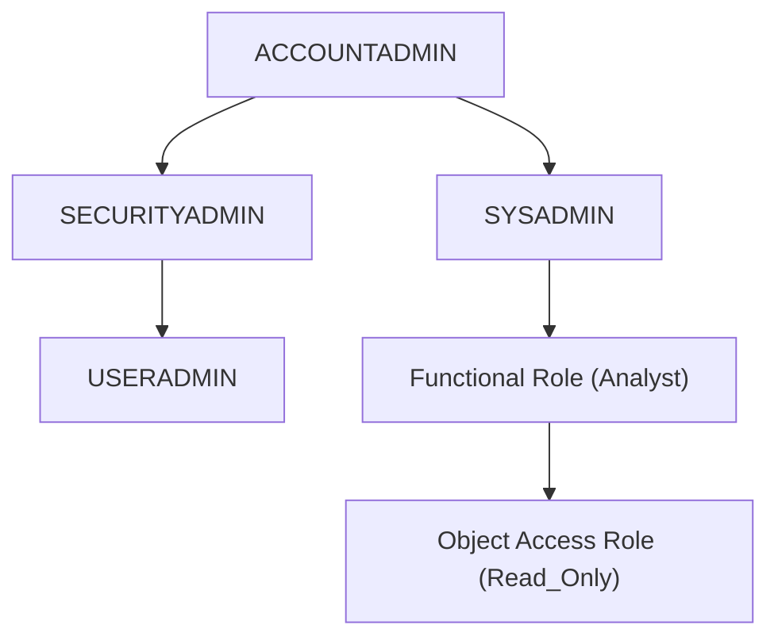

### 3. Dynamic Data Masking & RLS Flow
The automated path for protecting PII and sensitive data based on the user's active context.

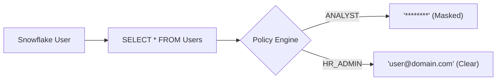

### 4. Network Isolation & PrivateLink Hub
Ensuring all data traffic remains within a secure, private network tunnel.

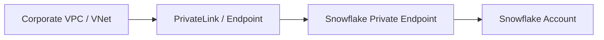

### 5. Audit & Compliance Telemetry Pipeline
Converting raw Snowflake query logs into actionable compliance records.

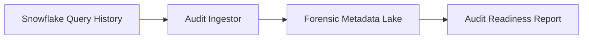

### 6. External Cloud Storage Security (IAM Integration)
Securing the connection between Snowflake and the underlying multi-cloud data lakes.

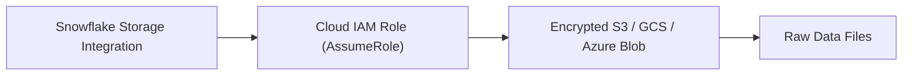

### 7. SCIM Identity & Lifecycle Provisioning
Automating user and role management to prevent stale account risks.

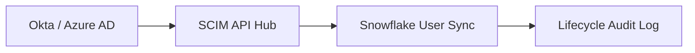

### 8. Automated Security & Configuration Scan
Continuous auditing of Snowflake objects for over-privileged access or misconfiguration.

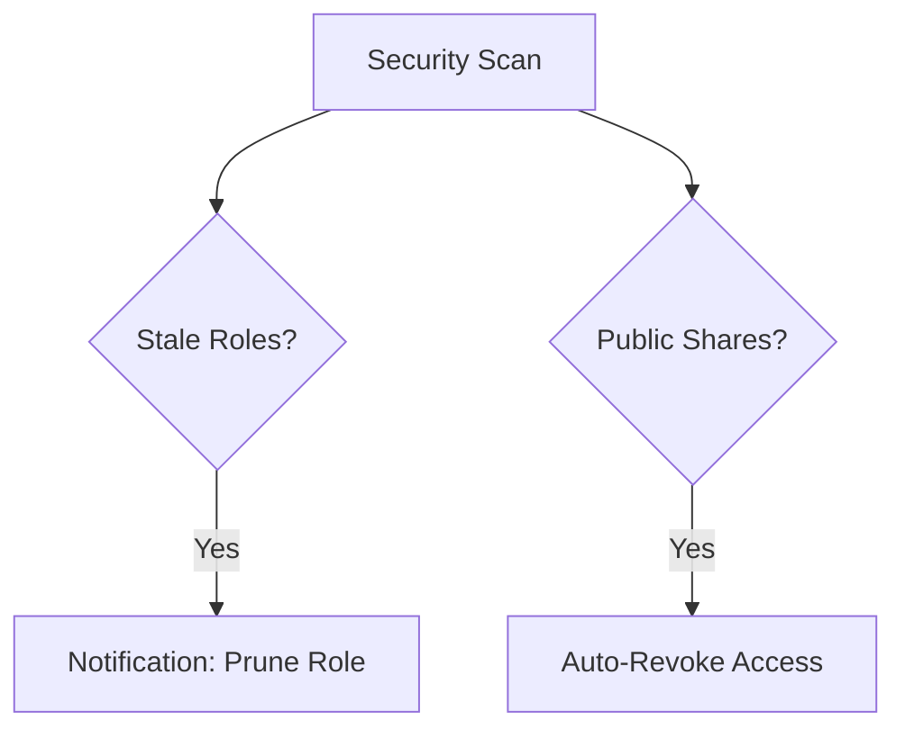

### 9. Key Management: Tri-Secret Secure
Visualizing the three-layered encryption strategy for institutional-grade data protection.

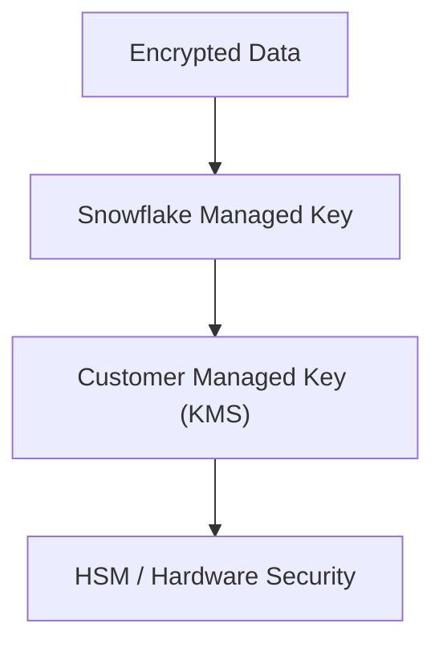

### 10. IaC Deployment: Security-as-Code for Snowflake
Using Terraform to version-control the entire security object model.

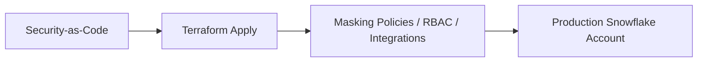

### 11. Metadata Lake for Data Forensics
Storing long-term query and access patterns for security investigations and audits.

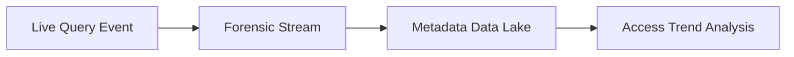

---

## 🏛️ Core Security Pillars

1.  **Precision Data Classification**: Centralized hub for scanning and tagging tables with sensitivity labels (PII, Sensitive, Public).
2.  **Dynamic Masking Orchestration**: Policy-driven engine that hides or obfuscates data in real time based on user roles.
3.  **Advanced RBAC Governance**: Strategic management of Snowflake role hierarchies and object-level privileges.
4.  **Query Anomaly Detection**: Intelligent monitoring of query history to detect suspicious patterns and full table scans.
5.  **Regulatory Compliance Mapping**: Automated mapping of security controls to GDPR, HIPAA, and SOC2 frameworks.
6.  **Immutable Governance Audit**: Comprehensive logging of every access request and policy evaluation for transparency.

---

## 🛠️ Technical Stack & Implementation

### Snowflake Engine & APIs
*   **Framework**: Python 3.11+ / FastAPI.
*   **Access Engine**: Strategic management of RBAC role hierarchies and privilege resolution.
*   **Masking Engine**: Dynamic role-based masking logic for PII and sensitive fields.
*   **Monitoring Engine**: Query history analyzer for detecting exfiltration and anomaly patterns.
*   **State Management**: PostgreSQL (Metadata) and Redis (Security Event Cache).

### Security Dashboard (UI)
*   **Framework**: React 18 / Vite.
*   **Theme**: Sky / Slate (Modern Cloud Security & Data aesthetic).
*   **Visualization**: Recharts for query velocity trendlines and data sensitivity heatmaps.

### Infrastructure & DevOps
*   **Runtime**: AWS EKS or Azure Kubernetes Service (AKS).
*   **IaC**: Modular Terraform for deploying the security toolkit and audit pipelines.

---

## 🏗️ IaC Mapping (Module Structure)

| Module | Purpose | Real Services |
| :--- | :--- | :--- |
| **`infrastructure/governance`** | Management plane and workers | EKS, PostgreSQL, Redis |
| **`infrastructure/integrations`** | Identity and storage connectors | SCIM, IAM, KMS, S3/GCS |
| **`infrastructure/policies`** | Security-as-Code definitions | Terraform Snowflake Provider |
| **`infrastructure/auditing`** | Query and access forensics | Athena, BigQuery, ELK |

---

## 🚀 Deployment Guide

### Local Principal Environment
```bash
# Clone the security toolkit
git clone https://github.com/devopstrio/snowflake-security-toolkit.git
cd snowflake-security-toolkit

# Configure environment
cp .env.example .env

# Launch the Security stack
make up

# Run a data classification scan
make classify-data

# Run query anomaly detection
make monitor-queries
```

Access the Security Command Center at `http://localhost:3000`.

---

## 📜 License
Distributed under the MIT License. See `LICENSE` for more information.

---
<div align="center">
  <p>© 2026 Devopstrio. All rights reserved.</p>
</div>
