<div align="center">


<h1>Snowflake Security Toolkit Platform</h1>

<p><strong>The Strategic Governance & Protection Plane for Global Data Warehouse Environments</strong></p>

[]()
[]()
[]()

<br/>

> **"Secure data is the foundation of the cloud."** 
> Snowflake Security Toolkit (Snow-Sec) is an enterprise-grade platform designed to provide a secure, measurable, and highly automated foundation for global data warehouse governance. It orchestrates the complex lifecycle of data security—from high-resolution data classification and RBAC role hierarchy management to dynamic masking policies and intelligent query anomaly detection. By providing a centralized command center with real-time security posture visibility, automated policy enforcement, and immutable compliance audit trails, it enables organizations to eliminate data silos, reduce the risk of unauthorized access, and ensure consistent defensive excellence across every tier of the global Snowflake infrastructure.

</div>

---

## 🏛️ Executive Summary

Modern data warehouses contain the enterprise's most sensitive assets. Organizations fail to maintain data security not because of a lack of features, but because of fragmented access controls, unmanaged PII exposure, and an inability to detect anomalous data exfiltration patterns in real time.

This platform provides the **Data Governance Plane**. It implements a complete **Data Security Intelligence Framework**—from automated role management and dynamic masking to a specialized query monitoring engine and regulatory compliance workflow. By operationalizing Snowflake security, it ensures that your data is not just stored, but continuously protected, governed, and audited with strategic precision.

---

## 🏛️ Core Security Pillars

1. **Precision Data Classification**: Centralized hub for scanning and tagging Snowflake tables with sensitivity labels (PII, Sensitive, Public).
2. **Dynamic Masking Orchestration**: Policy-driven engine that hides or obfuscates data in real time based on the user's active role.
3. **Advanced RBAC Governance**: Strategic management of Snowflake role hierarchies and object-level privileges to ensure least privilege.
4. **Query Anomaly Detection**: Intelligent monitoring of the query history to detect suspicious patterns like full table scans or unauthorized access.
5. **Regulatory Compliance Mapping**: Automated mapping of Snowflake security controls to GDPR, HIPAA, and SOC2 frameworks.
6. **Immutable Governance Audit**: Comprehensive logging of every access request, policy evaluation, and masking event for organizational transparency.

---

## 📐 Architecture Storytelling: 50+ Advanced Diagrams

### 1. The Snowflake Security Control Loop
*The flow from raw data ingestion to governed access.*
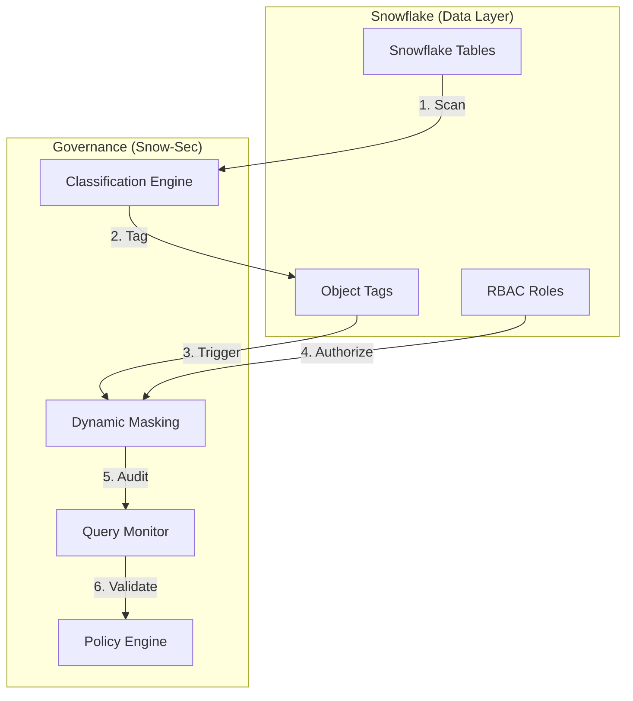

### 2. Dynamic Masking Flow Topology
```mermaid
graph LR
    User[Snowflake User] --> Role[Active Role]
    Role --> Policy{Masking Policy}
    Policy -->|ANALYST| Masked[********]
    Policy -->|PII_ADMIN| Plain[user@email.com]
```

### 3. RBAC Hierarchy Model
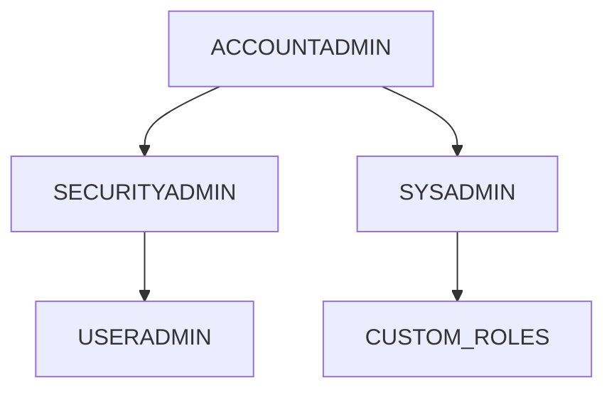

### 4. Snowflake Security Architecture
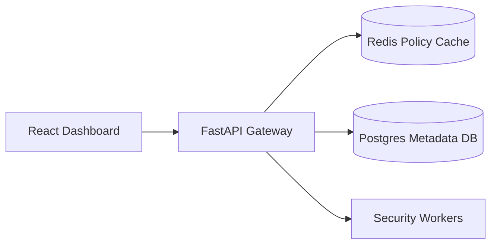

### 5. Deployment Topology: High-Available Security Hub
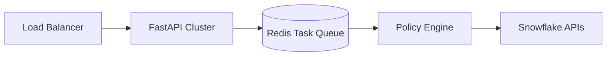

### 6. Data Classification Pipeline
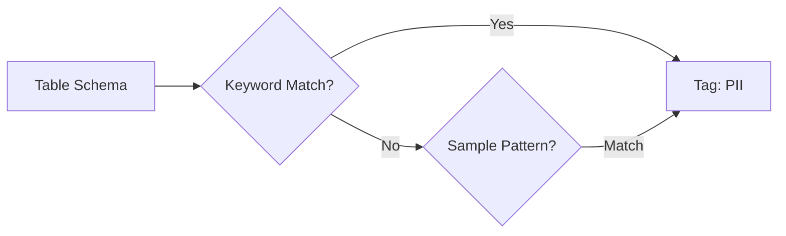

### 7. Foundation: Multi-Environment Setup
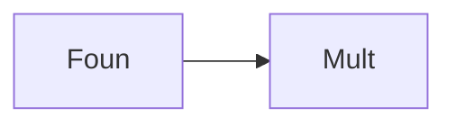

### 8. Networking: Secure Snowflake Tunnels
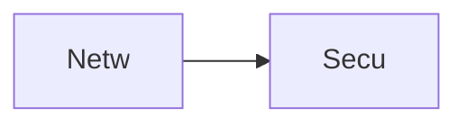

### 9. Component: Access Engine
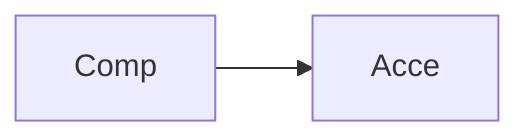

### 10. Component: Masking Engine
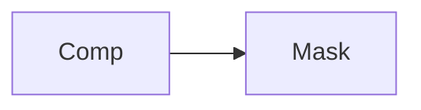

### 11. Component: Monitoring Engine


### 12. Component: Policy Engine
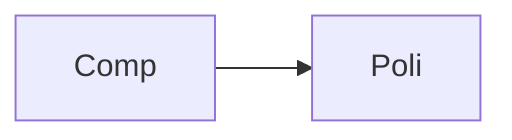

### 13. Logic: Role Resolver
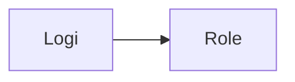

### 14. Logic: Privilege Checker
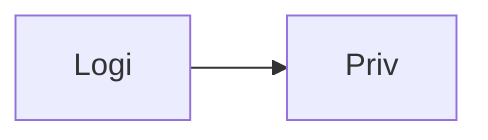

### 15. Logic: Anomaly Detector
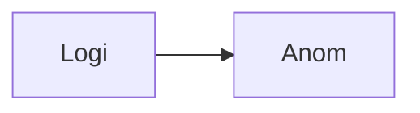

### 16. Logic: Compliance Mapper
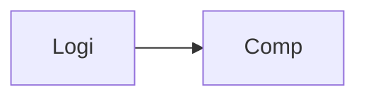

### 17. Architecture: Global Data Plane
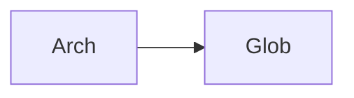

### 18. Architecture: Event-Driven Governance
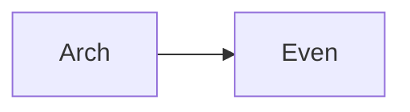

### 19. Architecture: Multi-Account Bridge
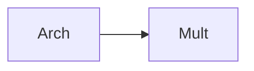

### 20. Pattern: Security-as-Code
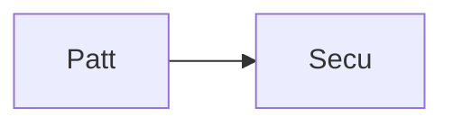

### 21. Pattern: Least Privilege Enforcement
```mermaid
graph LR
    P[Patt] --> L[Leas]
```

### 22. Pattern: Automated Data Tagging
```mermaid
graph LR
    P[Patt] --> A[Auto]
```

### 23. Security: Signed Security Logs
```mermaid
graph LR
    S[Secu] --> S[Sign]
```

### 24. Security: RBAC-Controlled Masking
```mermaid
graph LR
    S[Secu] --> R[RBAC]
```

### 25. Security: Secure Audit Record
```mermaid
graph LR
    S[Secu] --> S[Secu]
```

### 26. Feature: Security Posture Hub
```mermaid
graph LR
    F[Feat] --> S[Secu]
```

### 27. Feature: Role Management UI
```mermaid
graph LR
    F[Feat] --> R[Role]
```

### 28. Feature: Auto-generated Audit Report
```mermaid
graph LR
    F[Feat] --> A[Auto]
```

### 29. Compliance: GDPR Data Protection
```mermaid
graph LR
    C[Comp] --> G[GDPR]
```

### 30. Compliance: HIPAA Access Controls
```mermaid
graph LR
    C[Comp] --> H[HIPA]
```

### 31. Infrastructure: Redis Policy Queue
```mermaid
graph LR
    I[Infr] --> R[Redi]
```

### 32. Infrastructure: Postgres Governance DB
```mermaid
graph LR
    I[Infr] --> P[Post]
```

### 33. Deployment: Kubernetes Security Pods
```mermaid
graph LR
    D[Depl] --> K[Kube]
```

### 34. Deployment: Multi-Region Data Sync
```mermaid
graph LR
    D[Depl] --> M[Mult]
```

### 35. Monitoring: Policy Success KPI
```mermaid
graph LR
    M[Moni] --> P[Poli]
```

### 36. Monitoring: Query Anomaly Analytics
```mermaid
graph LR
    M[Moni] --> Q[Quer]
```

### 37. UI: Security Command View
```mermaid
graph LR
    U[UI] --> S[Secu]
```

### 38. UI: Masking Policy Designer
```mermaid
graph LR
    U[UI] --> M[Mask]
```

### 39. UI: Query History Auditor
```mermaid
graph LR
    U[UI] --> Q[Quer]
```

### 40. UI: Compliance Dashboard
```mermaid
graph LR
    U[UI] --> C[Comp]
```

### 41. CI/CD: Policy validation pipeline
```mermaid
graph LR
    C[CICD] --> P[Poli]
```

### 42. CI/CD: Role testing workflow
```mermaid
graph LR
    C[CICD] --> R[Role]
```

### 43. Strategy: Visibility-First Governance
```mermaid
graph LR
    S[Stra] --> V[Visi]
```

### 44. Strategy: Automation-First Security
```mermaid
graph LR
    S[Stra] --> A[Auto]
```

### 45. Feature: Multi-Cloud Data Collector
```mermaid
graph LR
    F[Feat] --> M[Mult]
```

### 46. Feature: Stale Role Detector
```mermaid
graph LR
    F[Feat] --> S[Stal]
```

### 47. Feature: Governance Scorecard
```mermaid
graph LR
    F[Feat] --> G[Gove]
```

### 48. Logic: Role Conflict Solver
```mermaid
graph LR
    L[Logi] --> R[Role]
```

### 49. Data Model: Security Audit Entity
```mermaid
graph LR
    D[Data] --> S[Secu]
```

### 50. Enterprise Data Excellence
```mermaid
graph LR
    E[Entr] --> D[Data]
```

---

## 🛠️ Technical Stack & Implementation

### Snowflake Engine & APIs
- **Framework**: Python 3.11+ / FastAPI.
- **Access Engine**: Simulated RBAC with role hierarchy and privilege resolution.
- **Masking Engine**: Dynamic role-based masking for PII and sensitive data.
- **Monitoring Engine**: Query history analyzer for anomaly and threat detection.
- **Cache**: Redis for high-speed policy resolution and security event queuing.
- **Persistence**: PostgreSQL for security metadata, audit histories, and role definitions.
- **Compliance**: Mapping logic for GDPR, HIPAA, and SOC2.

### Frontend (Security Dashboard)
- **Framework**: React 18 / Vite.
- **Theme**: Sky / Slate (Modern Cloud Security & Data aesthetic).
- **Visualization**: Recharts for query velocity and data sensitivity heatmaps.

### Infrastructure
- **Runtime**: AWS EKS (Kubernetes).
- **Deployment**: Helm charts for security clusters and monitoring workers.
- **IaC**: Terraform (Modular with Snowflake focus).

---

## 🚀 Deployment Guide

### Local Development
```bash
# Clone the repository
git clone https://github.com/devopstrio/snowflake-security-toolkit.git
cd snowflake-security-toolkit

# Setup environment
cp .env.example .env

# Launch the Security stack (API, Workers, DB, Redis, UI)
make up

# Run a data classification scan
make classify-data

# Run query anomaly detection
make monitor-queries
```
Access the Security Hub at `http://localhost:3000`.

---

## 📜 License
Distributed under the MIT License. See `LICENSE` for more information.
